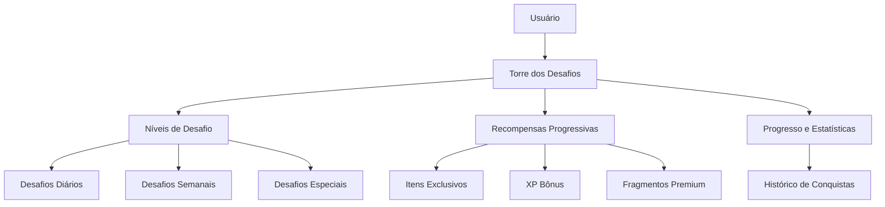

# Torre dos Desafios - Sistema de Desafios Progressivos

## 1. Visão Geral

### 1.1 Objetivo
Implementar um sistema de "Torre dos Desafios" inspirado nas manwhas chinesas, onde os usuários progridem através de níveis de dificuldade crescente, enfrentando desafios específicos que testam suas habilidades e oferecem recompensas progressivas.

### 1.2 Contexto
O Sistema Life já possui elementos de gamificação como missões, habilidades e guildas. A Torre dos Desafios adicionará uma nova camada de desafios progressivos que exigem do usuário um aumento gradual de habilidade e comprometimento.

## 2. Arquitetura

### 2.1 Estrutura Geral


### 2.2 Componentes Principais
- **TowerDashboard**: Interface principal da torre
- **ChallengeLevel**: Componente para cada nível da torre
- **ChallengeCard**: Carta representando cada desafio
- **RewardChest**: Componente para recompensas desbloqueáveis
- **ProgressTracker**: Rastreador de progresso do usuário

## 3. Estrutura da Torre

### 3.1 Níveis da Torre
A torre será composta por 100 níveis organizados em:
- **Andares 1-20**: Nível Iniciante (Desafios básicos de produtividade)
- **Andares 21-40**: Nível Intermediário (Desafios de consistência e foco)
- **Andares 41-60**: Nível Avançado (Desafios de disciplina e habilidades)
- **Andares 61-80**: Nível Especialista (Desafios complexos e multidisciplinares)
- **Andares 81-100**: Nível Mestre (Desafios extremos e transformacionais)

### 3.2 Tipos de Desafios

#### 3.2.1 Desafios Diários
- **Duração**: 24 horas
- **Quantidade**: 3 desafios por andar
- **Exemplos**: 
  - Completar 3 missões diárias
  - Manter um foco de 2 horas ininterruptas
  - Registrar progresso em 2 habilidades

#### 3.2.2 Desafios Semanais
- **Duração**: 7 dias
- **Quantidade**: 1 desafio por andar a cada 5 andares
- **Exemplos**:
  - Manter uma sequência de 7 dias de missões concluídas
  - Alcançar um total de 20 horas de foco na semana
  - Completar 5 missões específicas da semana

#### 3.2.3 Desafios Especiais
- **Duração**: Variável (1-30 dias)
- **Quantidade**: 1 desafio por zona
- **Exemplos**:
  - Criar e completar uma meta de longo prazo
  - Dominar uma nova habilidade
  - Completar 10 missões de um tipo específico

#### 3.2.4 Desafios de Guilda
- **Duração**: 3-7 dias
- **Quantidade**: 1 desafio por zona
- **Requisitos**: Membros da mesma guilda
- **Exemplos**:
  - Guilda completar 50 missões coletivas
  - Média de 80% de conclusão de missões por membro
  - Contribuição mínima por membro em XP

## 4. Sistema de Recompensas

### 4.1 Recompensas por Andar
Cada 10 andares completos desbloqueiam uma recompensa especial:
- **Andares 10, 20, 30**: Itens cosméticos para o avatar
- **Andares 40, 50, 60**: Poções e power-ups permanentes
- **Andares 70, 80, 90**: Habilidades especiais e bônus de atributos
- **Andar 100**: Recompensa lendária e título exclusivo

Recompensas adicionais a cada 25 andares:
- **Andares 25, 50, 75**: Baú especial com itens aleatórios
- **Andares 50, 100**: Habilidade única de classe

### 4.2 Recompensas Progressivas
- **XP Bônus**: Aumenta com a altura da torre
- **Fragmentos Premium**: Moeda rara obtida apenas na torre
- **Itens Exclusivos**: Equipamentos e cosméticos únicos
- **Títulos e Emblemas**: Reconhecimento de conquistas

## 5. Mecânicas de Gameplay

### 5.1 Progressão
- Usuários devem completar 3 desafios por andar para avançar
- Desafios aumentam em dificuldade com cada andar
- Usuários podem pular até 3 andares por dia usando itens especiais
- Cada zona (10 andares) requer completar todos os desafios da zona

### 5.2 Sistema de Vidas
- Cada usuário começa com 5 vidas diárias
- Falhar em um desafio consome 1 vida
- Vidas regeneram a cada 24 horas
- Itens especiais podem restaurar vidas
- Guildas podem compartilhar vidas entre membros (1 por dia)

### 5.3 Desafios Especiais
- **Desafios de Elite**: Disponíveis uma vez por semana
- **Desafios de Evento**: Temporários com recompensas únicas
- **Desafios de Guilda**: Exclusivos para membros de guildas
- **Desafios de Classe**: Baseados na classe do usuário
- **Desafios de Habilidade**: Focados em desenvolvimento de habilidades específicas

## 6. Integração com IA

### 6.1 Geração de Desafios
Utilizando os flows de IA existentes:
- `generate-next-daily-mission` para criar desafios diários
- Novo flow `generate-tower-challenge` para desafios específicos da torre
- Personalização baseada no nível e histórico do usuário
- `generate-skill-from-goal` para desafios de desenvolvimento de habilidades

### 6.2 Ajuste de Dificuldade
- Análise do desempenho do usuário para ajustar desafios
- Feedback contínuo para calibrar dificuldade
- Sistema de recomendação para desafios adequados
- Ajuste dinâmico com base em taxas de sucesso

### 6.3 Novos Flows de IA Necessários
- `generate-tower-challenge`: Cria desafios específicos da torre com base no andar
- `generate-guild-tower-challenge`: Cria desafios colaborativos para guildas
- `adjust-tower-difficulty`: Ajusta a dificuldade com base no desempenho do usuário

## 7. Interface do Usuário

### 7.1 Componentes de UI
- **TowerView**: Página principal da torre
- **ChallengeModal**: Modal detalhando cada desafio
- **RewardChestModal**: Modal para reivindicar recompensas
- **ProgressPanel**: Painel lateral com estatísticas
- **Leaderboard**: Ranking de usuários por andar alcançado
- **TowerMap**: Visualização da torre completa com andares conquistados
- **ChallengeTimer**: Contador regressivo para desafios ativos
- **LifeIndicator**: Indicador de vidas restantes

### 7.2 Fluxo de Navegação
1. Usuário acessa a aba "Torre dos Desafios"
2. Visualiza o andar atual e desafios disponíveis
3. Seleciona um desafio para ver detalhes
4. Aceita o desafio e inicia
5. Completa o desafio e recebe recompensas
6. Avança para o próximo andar

### 7.3 Visual Design
- Tema escuro com elementos brilhantes para representar a torre
- Efeitos visuais de progresso (luzes ascendendo)
- Animações de transição entre andares
- Feedback visual imediato para ações do usuário

## 8. Integração com Sistemas Existentes

### 8.1 Com Missões
- Desafios da torre podem gerar missões diárias
- Conclusão de missões contribui para desafios da torre
- Sincronização de progresso entre sistemas
- Reutilização de lógica de missões existentes

### 8.2 Com Guildas
- Guildas podem competir por posições no ranking da torre
- Desafios de guilda especiais
- Recompensas compartilhadas para guildas
- Contribuição individual conta para progresso da guilda
- Sistema de bônus por participação em guilda

### 8.3 Com Habilidades
- Desafios específicos para desenvolver habilidades
- Bônus de XP para habilidades relacionadas
- Desbloqueio de especializações
- Sincronização com sistema de progressão de habilidades
- Recompensas por dominar habilidades na torre

### 8.4 Com Sistema de Recompensas
- Integração com loja existente
- Novos itens exclusivos da torre
- Sistema de fragmentos premium
- Recompensas por conquistas especiais

## 9. Modelo de Dados

### 9.1 Estrutura de Desafios
```typescript
interface TowerChallenge {
  id: string;
  floor: number;
  zone: number; // Zona de 10 andares
  title: string;
  description: string;
  type: 'daily' | 'weekly' | 'special' | 'guild' | 'class' | 'skill';
  difficulty: 'beginner' | 'intermediate' | 'advanced' | 'expert' | 'master';
  requirements: ChallengeRequirement[];
  rewards: ChallengeRewards;
  timeLimit?: number; // em horas
  completed: boolean;
  completedAt?: string;
  startedAt?: string;
  participants?: string[]; // Para desafios de guilda
}

interface ChallengeRequirement {
  type: 'mission' | 'skill_level' | 'streak' | 'guild_activity' | 'level' | 'achievement';
  value: any;
  target: number;
  current?: number; // Progresso atual
}

interface ChallengeRewards {
  xp: number;
  fragments: number;
  premiumFragments: number;
  items: RewardItem[];
  title?: string;
  bonusXP?: number; // XP bônus
  effect?: ActiveEffect; // Efeitos temporários
}
```

### 9.2 Progresso do Usuário
```typescript
interface TowerProgress {
  currentFloor: number;
  highestFloor: number;
  currentZone: number;
  lives: number;
  maxLives: number;
  lastLifeRegeneration: string;
  completedChallenges: string[]; // IDs dos desafios concluídos
  claimedRewards: number[]; // Números dos andares com recompensas coletadas
  dailyChallengesAvailable: number; // Quantos desafios diários ainda podem ser gerados
  weeklyChallengesCompleted: number;
  specialChallengesCompleted: number;
  guildChallengesCompleted: number;
  totalChallengesCompleted: number;
  skippedFloors: number; // Quantos andares foram pulados
  maxSkippedFloors: number; // Máximo de andares que podem ser pulados
}
```

### 9.3 Recompensas Especiais
```typescript
interface SpecialReward {
  id: string;
  name: string;
  description: string;
  type: 'avatar_item' | 'consumable' | 'permanent_bonus' | 'title' | 'class_ability';
  rarity: 'common' | 'rare' | 'epic' | 'legendary' | 'mythic';
  requirements: RewardRequirement[];
  claimed: boolean;
  claimedAt?: string;
}

interface RewardRequirement {
  type: 'floor_reached' | 'challenges_completed' | 'zones_cleared' | 'guild_rank';
  value: number;
}

## 10. Funcionalidades Futuras

### 10.1 Eventos Especiais
- Torneios temporários com recompensas exclusivas
- Desafios colaborativos entre guildas
- Eventos sazonais com temas especiais
- Desafios de evento limitado (aniversário, feriados)
- Cross-over com outras funcionalidades do sistema

### 10.2 Personalização
- Caminhos de especialização dentro da torre
- Desafios personalizados baseados em interesses do usuário
- Sistema de construção de torre personalizada
- Escolha de temas visuais para a torre
- Personalização de avatar específico para a torre

### 10.3 Competição
- Leaderboards globais e por guilda
- Sistema de desafios PvP
- Recompensas por posições no ranking
- Sistema de apostas amigáveis entre usuários
- Competições sazonais com prêmios especiais

### 10.4 Expansão de Conteúdo
- Novas torres com temas diferentes
- Torre infinita com desafios gerados proceduralmente
- Torre de habilidades específicas
- Torre de classes especializadas

## 11. Implementação Técnica

### 11.1 Estrutura de Componentes
- `TowerView.tsx`: Componente principal
- `TowerFloor.tsx`: Componente para cada andar
- `ChallengeCard.tsx`: Componente para cada desafio
- `RewardChest.tsx`: Componente para recompensas
- `TowerProgress.tsx`: Componente de progresso

### 11.2 Novos Hooks
- `useTowerData`: Hook para gerenciar dados da torre
- `useTowerChallenges`: Hook para gerenciar desafios
- `useTowerRewards`: Hook para gerenciar recompensas

### 11.3 Integração com Firebase
- Nova coleção `tower_challenges`
- Nova coleção `tower_progress`
- Nova coleção `tower_rewards`
- Atualização do schema de perfil do usuário

### 11.4 Testes
- Testes unitários para lógica de progressão
- Testes de integração com sistemas existentes
- Testes de UI para componentes da torre
- Testes de desempenho para geração de desafios