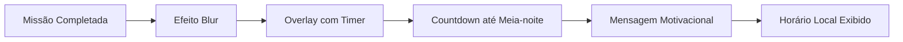
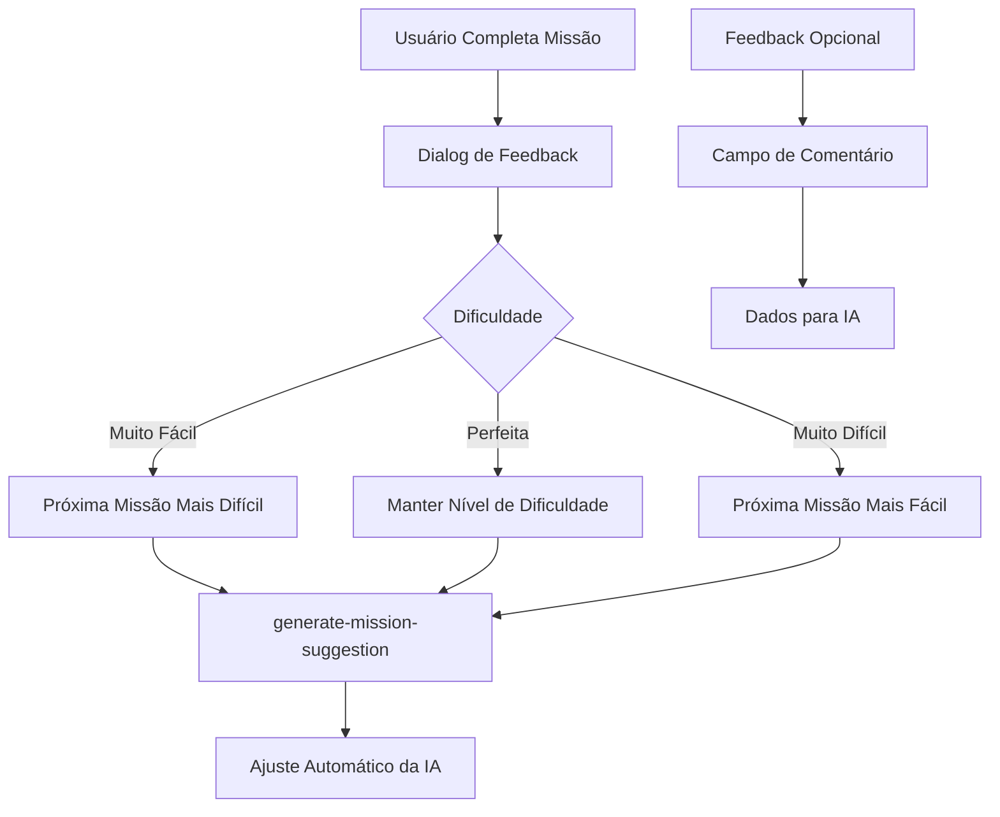
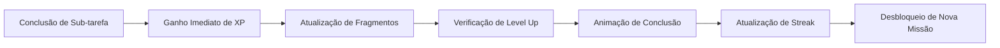
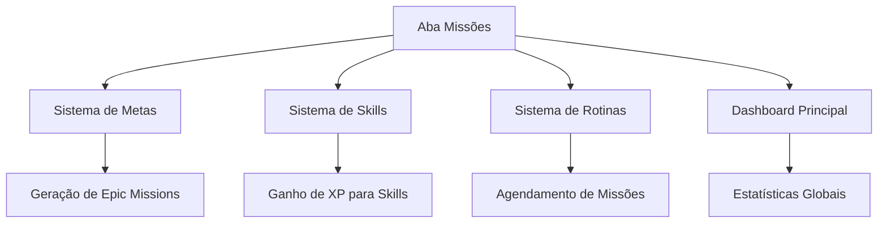
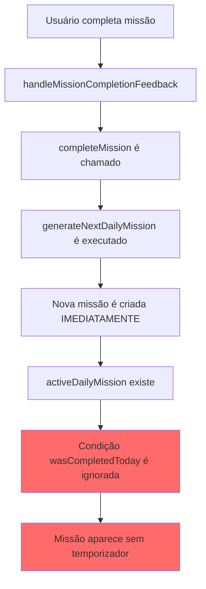
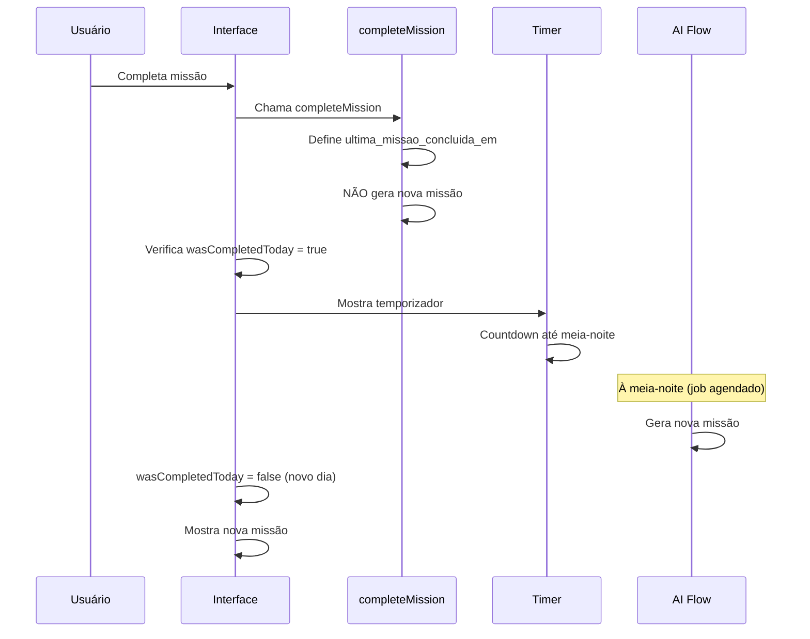

# Bug: Temporizador de Missão Não Funciona

## Descrição do Problema
Após completar uma missão e dar feedback, o sistema mostra brevemente "gerando nova missão", mas rapidamente exibe a nova missão sem respeitar a regra de esperar até meia-noite. O temporizador não aparece.

## Causa do Bug

**Problema Principal**: A função `completeMission` gera uma nova missão imediatamente, e a condição `activeDailyMission` tem prioridade sobre `wasCompletedToday` na renderização.

### Código Problemático

**MissionsView.tsx (linhas 751-875)**:
```typescript
// LÓGICA INCORRETA
{generatingMission === mission.id ? (
    <div>Gerando missão...</div>
) : wasCompletedToday ? (
    // NUNCA EXECUTA porque activeDailyMission existe
    <div>Temporizador...</div>
) : activeDailyMission ? (
    // SEMPRE EXECUTA quando nova missão existe
    <div>Missão ativa...</div>
) : (
    <div>Nenhuma missão...</div>
)}
```

**use-player-data.tsx (linhas 394-403)**:
```typescript
// completeMission gera nova missão IMEDIATAMENTE
const result = await generateNextDailyMission({...});
newDailyMission = {
    id: Date.now(),
    nome: result.nextMissionName,
    // Nova missão criada na mesma hora
};
```

## Solução

### 1. Corrigir Prioridade no MissionsView.tsx

**Alteração**: `wasCompletedToday` deve ter prioridade máxima:

```typescript
// LÓGICA CORRETA
{generatingMission === mission.id ? (
    <GeneratingMissionUI />
) : wasCompletedToday ? (
    // PRIORIDADE MÁXIMA - Sempre mostrar timer
    <MissionTimerUI timeUntilMidnight={timeUntilMidnight} />
) : activeDailyMission ? (
    // Só mostra se NÃO completou hoje
    <ActiveMissionUI mission={activeDailyMission} />
) : (
    <NoMissionUI />
)}
```

### 2. Modificar completeMission

**Remover geração imediata**:
```typescript
const completeMission = useCallback(async ({ rankedMissionId, dailyMissionId, subTask, amount, feedback }) => {
    // Atualizar progresso
    dispatch({ 
        type: 'UPDATE_SUB_TASK_PROGRESS', 
        payload: { rankedMissionId, dailyMissionId, subTaskName: subTask.name, amount } 
    });
    
    // Definir como completada HOJE
    dispatch({ 
        type: 'COMPLETE_DAILY_MISSION', 
        payload: { 
            rankedMissionId, 
            dailyMissionId, 
            newDailyMission: null // ❌ NÃO gerar nova missão
        } 
    });
    
    // ... resto da lógica (XP, skills, etc.) SEM generateNextDailyMission
}, []);
```

### 3. Gerar Missões à Meia-Noite

**Modificar useEffect do timer**:
```typescript
useEffect(() => {
    const calculateTimeUntilMidnight = () => {
        const now = new Date();
        const midnight = new Date(now);
        midnight.setHours(24, 0, 0, 0);
        
        const diff = midnight.getTime() - now.getTime();
        
        if (diff <= 0) {
            // MEIA-NOITE - Gerar missões pendentes
            setTimeUntilMidnight('00:00:00');
            generatePendingDailyMissions();
            return;
        }
        
        const hours = String(Math.floor((diff / (1000 * 60 * 60)) % 24)).padStart(2, '0');
        const minutes = String(Math.floor((diff / 1000 / 60) % 60)).padStart(2, '0');
        const seconds = String(Math.floor((diff / 1000) % 60)).padStart(2, '0');
        
        setTimeUntilMidnight(`${hours}:${minutes}:${seconds}`);
    };
    
    calculateTimeUntilMidnight();
    const timerId = setInterval(calculateTimeUntilMidnight, 1000);
    return () => clearInterval(timerId);
}, []);
```

**Nova função para gerar missões**:
```typescript
const generatePendingDailyMissions = async () => {
    const missionsNeedingNewDaily = missions.filter(mission => {
        const hasActiveDaily = mission.missoes_diarias?.some(dm => !dm.concluido);
        return !mission.concluido && !hasActiveDaily && mission.ultima_missao_concluida_em;
    });
    
    for (const mission of missionsNeedingNewDaily) {
        try {
            const result = await generateNextDailyMission({...});
            
            dispatch({
                type: 'ADD_DAILY_MISSION',
                payload: {
                    rankedMissionId: mission.id,
                    newDailyMission: {
                        id: Date.now(),
                        nome: result.nextMissionName,
                        // ... dados da missão
                    }
                }
            });
        } catch (error) {
            console.error('Erro ao gerar missão:', error);
        }
    }
};
```

### 4. Adicionar Action no Reducer

```typescript
case 'ADD_DAILY_MISSION': {
    const { rankedMissionId, newDailyMission } = action.payload;
    const updatedMissions = state.missions.map(rm => {
        if (rm.id === rankedMissionId) {
            return {
                ...rm,
                missoes_diarias: [...rm.missoes_diarias, newDailyMission]
            };
        }
        return rm;
    });
    return { ...state, missions: updatedMissions };
}
```

## Teste da Correção

1. ✅ Completar uma missão diária
2. ✅ Verificar que temporizador aparece (não nova missão)
3. ✅ Aguardar countdown até meia-noite
4. ✅ Verificar que nova missão aparece após meia-noite

**Debug útil**:
```typescript
console.log('Debug:', {
    wasCompletedToday,
    hasActiveDailyMission: !!activeDailyMission,
    shouldShowTimer: wasCompletedToday && !generatingMission
});
```
- Flexibilidade total na definição de sub-tarefas
- Não vinculadas a metas de longo prazo

## Interface de Usuário

### Layout Principal
```mermaid
graph TB
    A[Cabeçalho] --> B[Título: "Diário de Missões"]
    A --> C[Botão: Criar Missão Manual]
    A --> D[Toggle: Mostrar/Ocultar Estatísticas]
    
    E[Painel de Estatísticas] --> F[Streak Atual]
    E --> G[Melhor Streak]
    E --> H[Total de Missões]
    E --> I[Taxa Semanal]
    
    J[Filtros] --> K[Busca por Nome]
    J --> L[Filtro por Rank]
    J --> M[Filtro por Status]
    
    N[Lista de Missões] --> O[Acordeão Expansível]
    O --> P[Cartão de Missão]
    P --> Q[Informações da Missão]
    P --> R[Progresso Visual]
    P --> S[Sub-tarefas Interativas]
```

### Estados Visuais das Missões

#### Missão Ativa
- Borda colorida baseada no rank
- Sub-tarefas com barras de progresso
- Botões de contribuição para cada sub-tarefa
- Menu de feedback (dica, muito difícil, muito fácil)

#### Missão Completada Hoje


**Elementos Visuais**:
- Efeito blur (`blur-sm`) sobre o conteúdo
- Timer animado com efeitos de pulso
- Gradiente cyan para tema RPG
- Fonte Cinzel para consistência

#### Missão em Geração
- Ícone animado Sparkles
- Mensagem "A gerar nova missão..."
- Borda tracejada com efeitos de fade-in

## Sistema de Feedback e IA

### Coleta de Feedback


### Integração com IA
**Fluxos Utilizados**:
- `generate-daily-mission`: Primeira missão de uma epic
- `generate-next-daily-mission`: Missões subsequentes
- `generate-mission-suggestion`: Feedback e dicas
- `generate-mission-rewards`: Cálculo de recompensas

## Gerenciamento de Estado

### PlayerDataContext
```typescript
interface MissionState {
  missions: EpicMission[]
  generatingMission: string | null
  missionFeedback: Record<string, string>
}

interface EpicMission {
  id: string
  nome: string
  descricao: string
  rank: 'F' | 'E' | 'D' | 'C' | 'B' | 'A' | 'S' | 'SS' | 'SSS'
  meta_associada: string
  concluido: boolean
  missoes_diarias: DailyMission[]
  total_missoes_diarias: number
  ultima_missao_concluida_em?: string
}

interface DailyMission {
  id: string
  nome: string
  descricao: string
  subTasks: SubTask[]
  xp_conclusao: number
  fragmentos_conclusao: number
  concluido: boolean
  learningResources?: string[]
}
```

### Persistência de Dados
- Firebase Firestore para armazenamento
- Sincronização em tempo real
- Backup local para modo offline (futuro)

## Sistema de Recompensas

### Mecânicas de Gamificação


**Elementos Visuais**:
- Animação de conclusão com efeitos especiais
- Badges coloridos para XP e fragmentos
- Efeitos de partículas para level up
- Feedback visual imediato

## Sistema de Tempo e Zona Horária

### Controle de Missões Diárias
**Regras Temporais**:
- Novas missões liberadas à meia-noite (horário local)
- Timer de countdown em tempo real
- Verificação usando fuso horário -3 (BRT/BRST)
- Comparação apenas de data (ano/mês/dia)

**Implementação**:
```typescript
const wasCompletedToday = mission.ultima_missao_concluida_em && (() => {
  const completedDate = new Date(mission.ultima_missao_concluida_em);
  const today = new Date();
  
  return completedDate.getFullYear() === today.getFullYear() &&
         completedDate.getMonth() === today.getMonth() &&
         completedDate.getDate() === today.getDate();
})();
```

## Responsividade e Acessibilidade

### Design Responsivo
- Layout adaptativo para mobile e desktop
- Acordeão colapsável para organização
- Scroll areas com indicadores visuais
- Breakpoints: sm, md, lg

### Acessibilidade
- Labels ARIA para botões de ação
- Navegação por teclado suportada
- Contraste adequado para legibilidade
- Tooltips informativos

## Integração com Outros Módulos

### Conexões do Sistema


**Dados Compartilhados**:
- Progresso de metas
- XP e level do usuário
- Streaks e estatísticas
- Configurações de usuário

### Código Específico do Problema

**Arquivo**: `src/components/views/core/MissionsView.tsx` (linhas 751-875)

**Problema na estrutura condicional**:
```typescript
// LÓGICA ATUAL (INCORRETA)
{generatingMission === mission.id ? (
    <div className="bg-secondary/30...">
        <Sparkles className="h-10 w-10 text-primary animate-pulse mb-4"/>
        <p className="text-lg font-bold text-foreground">A gerar nova missão...</p>
    </div>
) : wasCompletedToday ? (
    // Temporizador (NUNCA EXECUTA porque activeDailyMission existe)
    <div className="bg-gradient-to-br from-background/95...">
        <Timer className="h-16 w-16 text-cyan-400 mb-4 mx-auto animate-pulse"/>
        // ... countdown display
    </div>
) : activeDailyMission ? (
    // ESTE BLOCO SEMPRE EXECUTA quando nova missão existe
    <div className="bg-secondary/50 border-l-4 border-primary...">
        <p className="text-lg font-bold text-foreground">{activeDailyMission.nome}</p>
        // ... missão ativa
    </div>
) : (
    <div className="bg-secondary/30 border-2 border-dashed border-red-500/50...">
        <AlertTriangle className="h-10 w-10 text-red-500 mb-4"/>
        <p className="text-lg font-bold text-foreground">Nenhuma Missão Ativa</p>
    </div>
)}
```

**Problema no `use-player-data.tsx`** (linhas 394-403):
```typescript
// completeMission chama generateNextDailyMission IMEDIATAMENTE
const result = await generateNextDailyMission({
    rankedMissionName: tempRankedMission.nome,
    metaName: meta?.nome || "Objetivo geral",
    goalDeadline: meta?.prazo,
    history: history || `O utilizador acabou de completar: "${tempDailyMission.nome}".`,
    userLevel: updatedProfile.nivel,
    feedback: feedbackForAI
});

// Nova missão é adicionada IMEDIATAMENTE
newDailyMission = {
    id: Date.now(),
    nome: result.nextMissionName,
    // ...
};
```

**Redução do problema no reducer** (linhas 88-116):
```typescript
case 'COMPLETE_DAILY_MISSION': {
    const { rankedMissionId, dailyMissionId, newDailyMission } = action.payload;
    const updatedMissions = state.missions.map(rm => {
        if (rm.id === rankedMissionId) {
            const newDailyMissionsList = rm.missoes_diarias.map(dm => 
                dm.id === dailyMissionId ? { ...dm, concluido: true, completed_at: new Date().toISOString() } : dm
            );
            // PROBLEMA: Nova missão é adicionada IMEDIATAMENTE
            if (newDailyMission) {
                newDailyMissionsList.push(newDailyMission);
            }
            return { 
                ...rm, 
                missoes_diarias: newDailyMissionsList, 
                ultima_missao_concluida_em: new Date().toISOString() // ✅ Correto
            };
        }
        return rm;
    });
    return { ...state, missions: updatedMissions };
}
```

### Solução Técnica Detalhada

**1. Corrigir MissionsView.tsx**:
```typescript
// LÓGICA CORRETA
{generatingMission === mission.id ? (
    // Estado: Gerando missão
    <GeneratingMissionUI />
) : wasCompletedToday ? (
    // PRIORIDADE MÁXIMA - Sempre mostrar timer se completou hoje
    <MissionTimerUI timeUntilMidnight={timeUntilMidnight} />
) : activeDailyMission ? (
    // Só mostra missão ativa se NÃO completou hoje
    <ActiveMissionUI mission={activeDailyMission} />
) : (
    // Nenhuma missão disponível
    <NoMissionUI />
)}
```

**2. Modificar completeMission para não gerar nova missão**:
```typescript
// Opção A: Remover geração imediata
const completeMission = useCallback(async ({ rankedMissionId, dailyMissionId, subTask, amount, feedback }) => {
    // ... atualizar progresso
    
    // ✅ Definir ultima_missao_concluida_em
    dispatch({ 
        type: 'COMPLETE_DAILY_MISSION', 
        payload: { 
            rankedMissionId, 
            dailyMissionId, 
            newDailyMission: null // ❌ Não gerar nova missão
        } 
    });
    
    // ... resto da lógica sem generateNextDailyMission
}, [/* deps */]);
```

**3. Adicionar verificação à meia-noite**:
```typescript
// No useEffect do timer
useEffect(() => {
    const calculateTimeUntilMidnight = () => {
        const now = new Date();
        const midnight = new Date(now);
        midnight.setHours(24, 0, 0, 0);
        
        const diff = midnight.getTime() - now.getTime();
        
        if (diff <= 0) {
            // MEIA-NOITE CHEGOU
            setTimeUntilMidnight('00:00:00');
            
            // Adicionar missões pendentes
            addPendingMissionsToActive();
            return;
        }
        
        // ... resto do cálculo
    };
    
    calculateTimeUntilMidnight();
    const timerId = setInterval(calculateTimeUntilMidnight, 1000);
    return () => clearInterval(timerId);
}, []);
```

### Verificação da Correção

**Teste Manual**:
1. ✅ Completar uma missão diária
2. ✅ Verificar que `wasCompletedToday` retorna `true`
3. ✅ Confirmar que temporizador aparece (não missão nova)
4. ✅ Aguardar countdown até meia-noite
5. ✅ Verificar que nova missão aparece após meia-noite

**Logs de Debug**:
```typescript
console.log('Debug Missão:', {
    missionName: mission.nome,
    completedAt: mission.ultima_missao_concluida_em,
    wasCompletedToday,
    hasActiveDailyMission: !!activeDailyMission,
    generatingMission: generatingMission === mission.id,
    shouldShowTimer: wasCompletedToday && !generatingMission
});
```

## Problema Identificado: Temporizador de Missão Não Funciona

### Descrição do Bug
Após completar uma missão e dar feedback, o sistema mostra brevemente um blur e "gerando nova missão", mas rapidamente exibe a nova missão sem respeitar a regra de esperar até meia-noite. O temporizador com countdown não aparece.

### Análise da Causa Raiz


**Problema na Lógica**:
1. A função `completeMission` define `ultima_missao_concluida_em` corretamente
2. Mas também gera imediatamente uma nova missão via `generateNextDailyMission`
3. A condição `activeDailyMission` tem prioridade sobre `wasCompletedToday`
4. O temporizador nunca é mostrado porque existe uma missão ativa

### Ordem de Renderização Incorreta
```typescript
// CÓDIGO ATUAL (INCORRETO)
{generatingMission === mission.id ? (
    // Estado: Gerando missão
) : wasCompletedToday ? (
    // Estado: Temporizador
) : activeDailyMission ? (
    // Estado: Missão ativa (APARECE IMEDIATAMENTE)
) : (
    // Estado: Nenhuma missão
)}
```

### Solução Necessária
**Modificar a lógica de renderização**:
```typescript
// ORDEM CORRETA
{generatingMission === mission.id ? (
    // Estado: Gerando missão
) : wasCompletedToday ? (
    // Estado: Temporizador (PRIORIDADE MÁXIMA)
) : activeDailyMission ? (
    // Estado: Missão ativa
) : (
    // Estado: Nenhuma missão
)}
```

**Alterações necessárias no código**:
1. **Priorizar `wasCompletedToday`** sobre `activeDailyMission`
2. **Modificar `completeMission`** para NÃO gerar nova missão imediatamente
3. **Criar job agendado** para gerar missões à meia-noite
4. **Garantir que `ultima_missao_concluida_em`** seja atualizado corretamente

### Fluxo Correto Esperado


## Especificação da Correção

### 1. Modificar lógica de renderização em MissionsView
- **Prioridade**: `wasCompletedToday` deve ter precedência absoluta
- **Condição**: Se missão foi completada hoje, SEMPRE mostrar temporizador
- **Ignorar**: Presença de `activeDailyMission` quando `wasCompletedToday = true`

### 2. Modificar função completeMission
- **Remover**: Chamada automática para `generateNextDailyMission`
- **Manter**: Atualização de `ultima_missao_concluida_em`
- **Adicionar**: Flag para controlar geração diferida

### 3. Implementar sistema de geração agendada
- **Opção A**: Job Firebase Functions à meia-noite
- **Opção B**: Verificação no cliente ao abrir aplicação
- **Opção C**: Geração lazy quando timer expira

### 4. Garantir consistência temporal
- **Fuso horário**: Usar horário local (-3 BRT/BRST)
- **Comparação**: Apenas data (ano/mês/dia)
- **Precisão**: Timer atualizado a cada segundo

## Futuras Melhorias

### Recursos Planejados
- Sistema de conquistas integrado
- Modo offline com sincronização
- Missões colaborativas (guilds)
- IA mais avançada para personalização
- Analytics detalhados de desempenho
- Notificações push inteligentes

### Otimizações Técnicas
- Cache local para melhor performance
- Lazy loading de componentes
- Otimização de queries Firebase
- Testes automatizados abrangentes