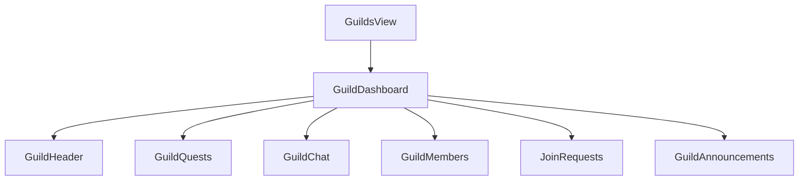
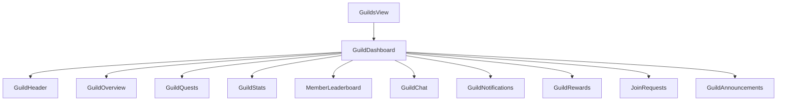
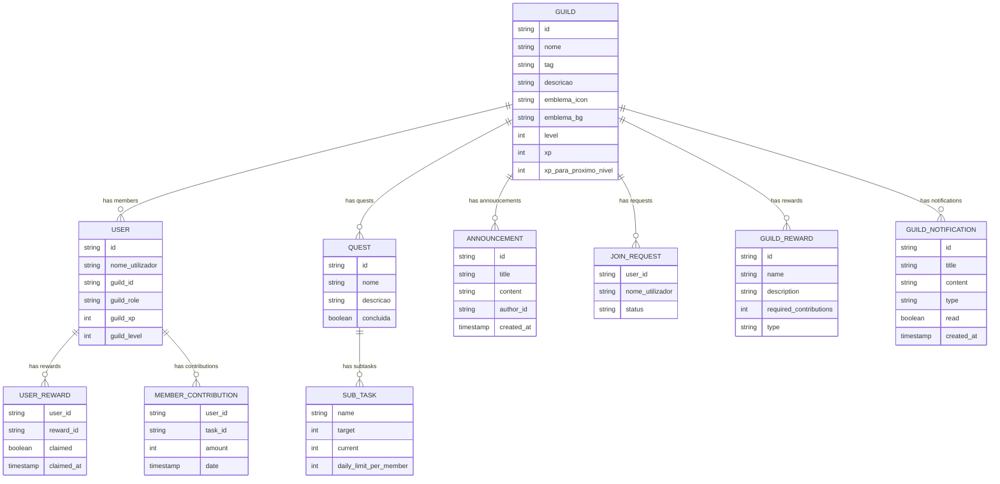
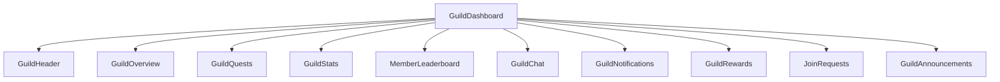
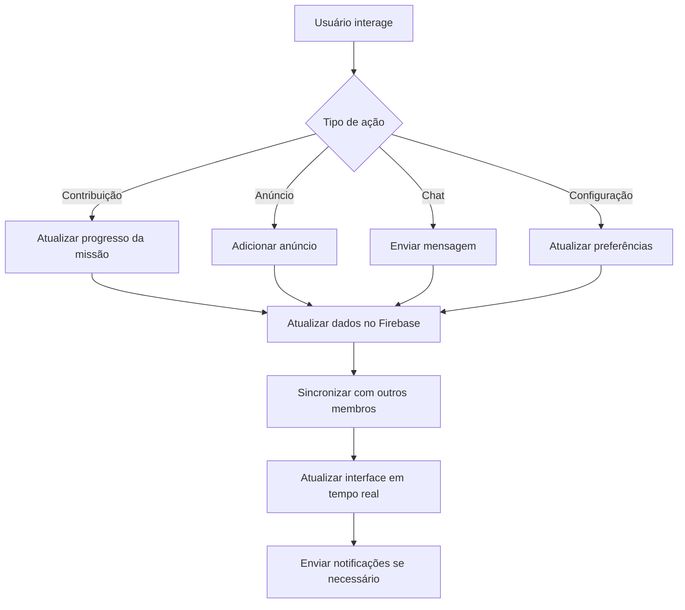

# Melhoria da Aba de Guilda no Sistema Life

## 1. Visão Geral

### 1.1 Objetivo
Melhorar a experiência do usuário na aba de guildas do Sistema Life, otimizando a interface, adicionando novas funcionalidades e aprimorando a usabilidade geral do sistema de guildas, com foco em engajamento e colaboração entre os membros.

### 1.2 Contexto Atual
O Sistema Life possui um sistema de guildas funcional com os seguintes componentes principais:
- Criação e gerenciamento de guildas
- Sistema de missões colaborativas
- Chat em tempo real
- Anúncios da guilda
- Gerenciamento de membros e solicitações de entrada
- Hierarquia de papéis (Líder, Oficial, Veterano, Membro, Recruta)

### 1.3 Problemas Identificados
- Interface pode ser mais intuitiva e visualmente atraente
- Falta de visibilidade do progresso individual e da guilda
- Sistema de recompensas por contribuição ausente
- Necessidade de melhorias na visualização de estatísticas e rankings
- Falta de engajamento contínuo dos membros
- Dificuldade em acompanhar contribuições e desempenho ao longo do tempo

## 2. Arquitetura Atual do Sistema de Guildas

### 2.1 Estrutura de Componentes Atuais


### 2.2 Nova Estrutura de Componentes Proposta


### 2.2 Modelo de Dados da Guilda


## 3. Funcionalidades Propostas para Melhoria

### 3.1 Interface e Experiência do Usuário

#### 3.1.1 Redesign da Interface da Guilda
- Implementação de um layout mais moderno e intuitivo com cards bem definidos
- Melhoria na visualização de informações importantes com destaque visual
- Otimização para dispositivos móveis com layout responsivo
- Adição de indicadores visuais para notificações e atividades
- Implementação de tema dark/light mode

#### 3.1.2 Painel de Visão Geral da Guilda
- Exibição de estatísticas da guilda (nível, XP, número de membros) com gráficos
- Destaque para missões em andamento e seu progresso com barras de progresso visuais
- Resumo de anúncios recentes com preview
- Indicadores de atividade dos membros com badges
- Seção de eventos recentes e próximos eventos

### 3.2 Sistema de Missões Aprimorado

#### 3.2.1 Visualização de Progresso Individual
- Adição de gráficos de progresso por membro (semanal, mensal)
- Comparação de contribuições entre membros com ranking
- Histórico de contribuições por período selecionável
- Indicadores de desempenho em relação à média da guilda

#### 3.2.2 Sistema de Recompensas
- Implementação de recompensas por participação em missões
- Sistema de conquistas específicas para missões de guilda
- Mostradores de recompensas pendentes de coleta
- Recompensas especiais por marcos de contribuição
- Sistema de loot por conclusão de missões

### 3.3 Sistema de Membros

#### 3.3.1 Perfil do Membro
- Expansão do perfil com estatísticas de contribuição
- Histórico de participação em missões
- Conquistas específicas da guilda
- Nível e XP específicos da guilda
- Atividade recente do membro

#### 3.3.2 Sistema de Classificação
- Ranking de membros por contribuição (semanal, mensal, total)
- Categorias de desempenho (Ouro, Prata, Bronze)
- Recompensas especiais para os membros mais ativos
- Distintivos visuais para posições no ranking
- Comparação com o desempenho anterior

### 3.4 Comunicação e Interações

#### 3.4.1 Sistema de Notificações
- Notificações em tempo real para eventos da guilda
- Configurações personalizáveis de notificações
- Histórico de notificações
- Notificações push para eventos importantes
- Indicador de notificações não lidas

#### 3.4.2 Melhorias no Chat
- Sistema de canais de chat (geral, oficiais, social)
- Menções e destaque de mensagens
- Histórico de conversas
- Emojis e formatação de texto
- Integração com sistema de recompensas por participação

## 4. Componentes e Implementação Propostos

### 4.1 GuildDashboard (Componente Principal)
```typescript
// Novo componente GuildDashboard com funcionalidades expandidas
interface GuildDashboardProps {
  guild: GuildData;
  profile: UserProfile;
  members: GuildMember[];
  onGuildUpdate: (updatedGuild: GuildData) => void;
  onLeaveGuild: () => void;
  onEdit: () => void;
  allUsers: UserData[];
  setAllUsers: (users: UserData[]) => void;
}
```

### 4.1.1 Estrutura de Componentes do Novo Dashboard


### 4.2 Novo Componente: GuildOverview
```typescript
// Componente para exibir visão geral da guilda
interface GuildOverviewProps {
  guild: GuildData;
  members: GuildMember[];
  quests: Quest[];
  recentAnnouncements: Announcement[];
  userRole: string;
}
```

### 4.3 Novo Componente: GuildStats
```typescript
// Componente para exibir estatísticas da guilda
interface GuildStatsProps {
  guild: GuildData;
  members: GuildMember[];
  quests: Quest[];
  period: "weekly" | "monthly" | "total";
}
```

### 4.4 Novo Componente: MemberLeaderboard
```typescript
// Componente para exibir o ranking de membros
interface MemberLeaderboardProps {
  members: GuildMember[];
  contributions: MemberContribution[];
  period: "weekly" | "monthly" | "total";
}
```

### 4.5 Novo Componente: GuildNotifications
```typescript
// Componente para gerenciar notificações da guilda
interface GuildNotificationsProps {
  notifications: GuildNotification[];
  onMarkAsRead: (id: string) => void;
  onDismiss: (id: string) => void;
}
```

### 4.6 Novo Componente: GuildRewards
```typescript
// Componente para exibir e gerenciar recompensas da guilda
interface GuildRewardsProps {
  rewards: GuildReward[];
  userRewards: UserReward[];
  onClaimReward: (rewardId: string) => void;
}
```

## 5. Fluxo de Dados e Integração com Firebase

### 5.1 Atualização de Estado


### 5.2 Integração com Firebase
- Manutenção da estrutura de dados existente
- Adição de novos campos para estatísticas e contribuições
- Otimização das consultas para melhor desempenho
- Implementação de listeners para notificações em tempo real
- Cache de dados para melhor experiência offline

## 6. Considerações de Design e UX

### 6.0 Paleta de Cores e Temas
- Manutenção da identidade visual do Sistema Life
- Cores complementares para elementos da guilda
- Tema dark/light mode com toggle
- Cores específicas para diferentes níveis de membros
- Cores para indicar progresso e status

### 6.1 Design Responsivo
- Layout adaptável para diferentes tamanhos de tela
- Priorização de informações importantes em dispositivos móveis
- Controles otimizados para toque
- Sistema de grid flexível para reorganização de componentes
- Breakpoints otimizados para mobile, tablet e desktop
- Componentes com comportamento adaptável conforme o espaço disponível

### 6.2 Acessibilidade
- Suporte a leitores de tela
- Contraste adequado para usuários com deficiência visual
- Navegação por teclado
- Tamanhos de fonte ajustáveis
- Modo de alto contraste

### 6.3 Feedback Visual
- Animações para interações importantes
- Indicadores claros de progresso
- Feedback imediato para ações do usuário
- Efeitos visuais para conquistas e recompensas
- Sistema de tema personalizável

## 7. Estratégia de Testes

### 7.1 Testes Unitários
- Testes para componentes principais (GuildDashboard, GuildStats, MemberLeaderboard)
- Testes para funções de cálculo de estatísticas
- Testes para validação de dados
- Testes para hooks personalizados
- Testes de renderização condicional
- Testes de manipulação de estado

### 7.2 Testes de Integração
- Testes de fluxo completo de missões
- Testes de sincronização em tempo real
- Testes de permissões de usuário
- Testes de notificações em tempo real
- Testes de chat e comunicação
- Testes de recompensas e conquistas

### 7.3 Testes de Usabilidade
- Avaliação da experiência do usuário com o novo design
- Testes A/B para diferentes layouts
- Feedback de usuários reais
- Testes de desempenho em dispositivos móveis
- Testes de acessibilidade com ferramentas especializadas
- Testes de engajamento e retenção

### 7.4 Testes de Performance
- Testes de carga para múltiplos usuários simultâneos
- Testes de responsividade em diferentes dispositivos
- Testes de consumo de banda e otimização de dados
- Testes de fallback para conexões lentas

## 8. Considerações Finais e Próximos Passos

### 8.1 Benefícios Esperados
- Maior engajamento dos membros da guilda
- Melhor visibilidade do progresso individual e coletivo
- Sistema de recompensas motivador
- Interface mais intuitiva e atraente

### 8.2 Cronograma Sugerido
1. Desenvolvimento dos novos componentes principais (GuildOverview, GuildStats, MemberLeaderboard)
2. Implementação do sistema de recompensas e notificações
3. Melhorias na interface e experiência do usuário
4. Testes e refinamentos
5. Lançamento e coleta de feedback

### 8.3 Próximas Etapas
- Desenvolvimento iterativo com base no feedback dos usuários
- Adição de novas funcionalidades com base na evolução do sistema
- Monitoramento contínuo do engajamento e desempenho
- Expansão para funcionalidades de guildas competitivas e eventos