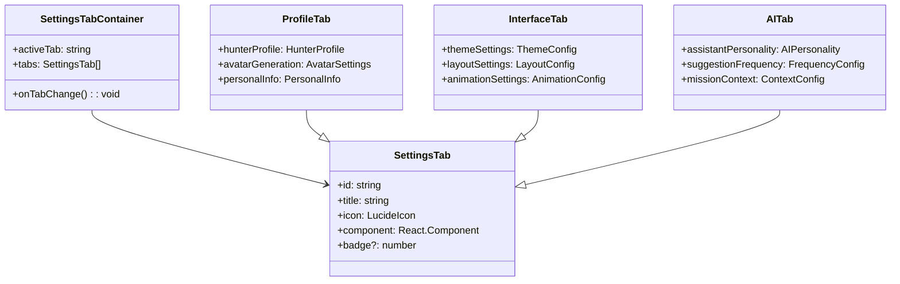
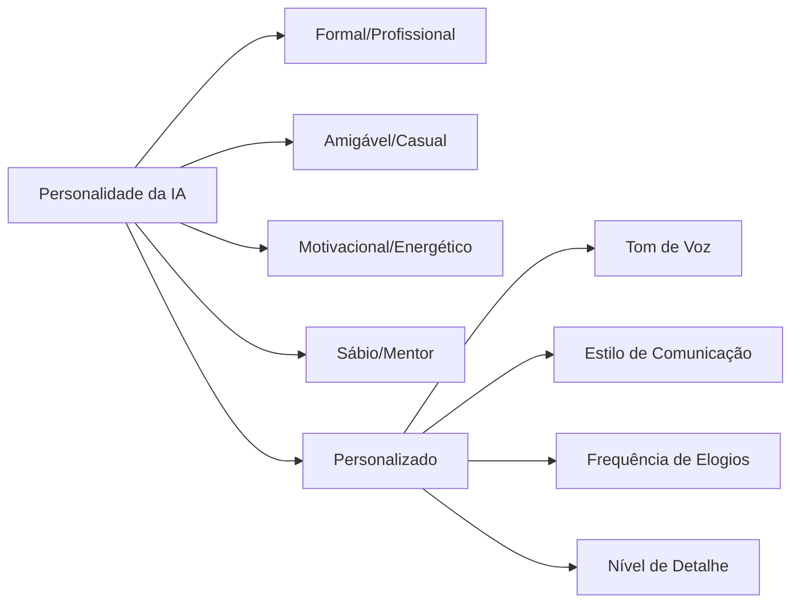
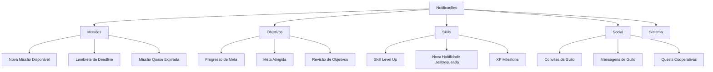
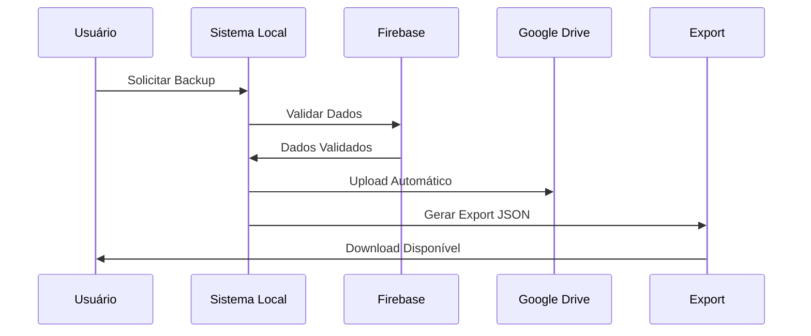
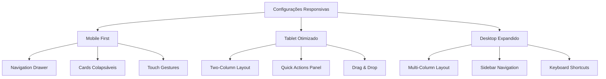
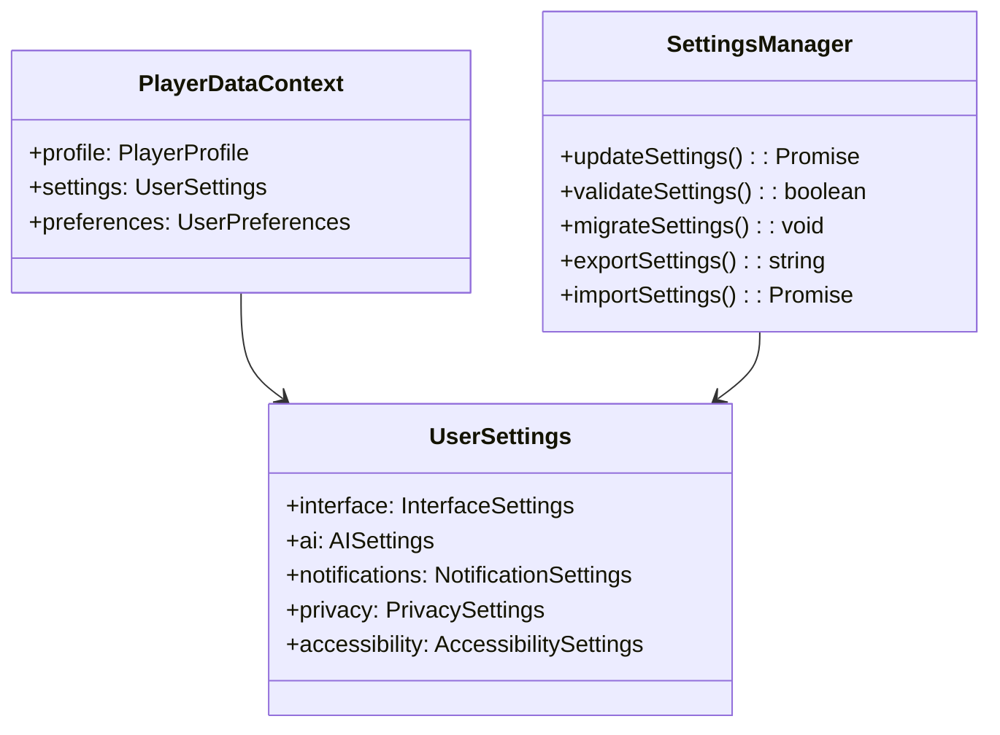
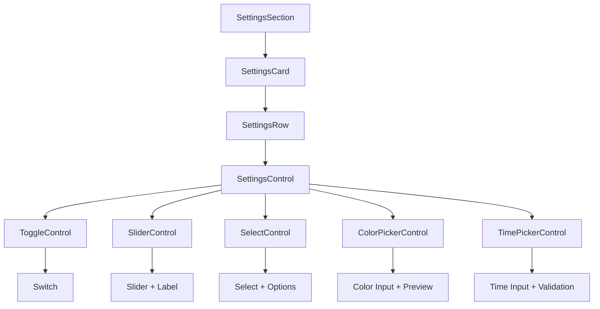

# Melhorias para Aba de Configurações - SistemaLife

## Visão Geral

Esta proposta de melhoria visa expandir significativamente a funcionalidade da aba de configurações do SistemaLife, transformando-a de uma simples tela de edição de perfil em um centro de controle abrangente para personalização da experiência do usuário. As melhorias propostas baseiam-se na análise da implementação atual e nas funcionalidades existentes do sistema.

## Arquitetura de Configurações Proposta

```mermaid
graph TB
subgraph "Configurações do Sistema"
A[Perfil do Caçador] --> E[Centro de Configurações]
B[Preferências de Interface] --> E
C[Configurações de IA] --> E
D[Notificações & Alertas] --> E
F[Privacidade & Segurança] --> E
G[Dados & Backup] --> E
H[Acessibilidade] --> E
I[Gamificação] --> E
end

subgraph "Categorias Expandidas"
B --> B1[Tema Visual]
B --> B2[Layout Adaptativo]
B --> B3[Animações]
C --> C1[Personalidade da IA]
C --> C2[Frequência de Sugestões]
C --> C3[Contexto de Missões]
D --> D1[Tipos de Notificação]
D --> D2[Horários Preferidos]
D --> D3[Canais de Comunicação]
end
```



## Estrutura de Componentes Melhorada

### 1. Reorganização da Interface

#### Navegação por Abas


### 2. Categorias de Configuração Expandidas

#### A. Configurações de Interface Aprimoradas

**Temas Visuais Personalizáveis**
- Sistema de temas com paletas de cores customizáveis
- Modo escuro/claro com gradientes personalizados
- Temas sazonais ou baseados no nível do jogador
- Preview em tempo real das mudanças

**Layout Adaptativo**
- Densidade de informações (compacto, padrão, expandido)
- Posicionamento de elementos da interface
- Tamanho de fontes e ícones
- Configuração de sidebar (retraída, expandida, auto)

#### B. Configurações de IA Personalizadas

**Personalidade do Assistente**


**Configurações de Geração de Conteúdo**
- Frequência de sugestões de missões
- Tipo de desafios preferidos
- Nível de dificuldade automático vs manual
- Contexto temporal para geração de rotinas

#### C. Sistema de Notificações Avançado

**Tipos de Notificação Granulares**


**Horários Inteligentes**
- Configuração de horários preferenciais por tipo de notificação
- Modo "não perturbar" com exceções
- Detecção automática de fuso horário
- Sincronização com calendário pessoal

#### D. Configurações de Gamificação

**Personalização de Recompensas**
- Preferências de tipos de conquistas
- Configuração de celebrações visuais
- Intensidade de feedback de progresso
- Personalização de badges e títulos

**Balanceamento de Dificuldade**
- Sistema de dificuldade adaptativa
- Configuração manual de desafios
- Preferências de progressão (linear vs exponencial)

### 3. Funcionalidades Avançadas Propostas

#### A. Backup e Sincronização



**Recursos de Backup**
- Backup automático para Google Drive
- Export de dados em formato JSON/CSV
- Histórico de backups com versionamento
- Restauração seletiva de dados
- Migração entre dispositivos

#### B. Analytics Pessoais

**Dashboard de Métricas**
- Análise de produtividade por período
- Padrões de comportamento identificados pela IA
- Relatórios de progresso personalizáveis
- Comparação temporal de estatísticas
- Identificação de melhores horários de produtividade

#### C. Configurações de Privacidade

**Controles de Dados**
- Configuração de dados compartilháveis em guilds
- Visibilidade de perfil público/privado
- Controle de analytics opcionais
- Configuração de retenção de dados
- Solicitação de exclusão de dados (GDPR)

### 4. Melhorias de UX/UI

#### A. Interface Responsiva Aprimorada



#### B. Funcionalidades de Acessibilidade

**Suporte Universal**
- Alto contraste e temas para daltonismo
- Navegação por teclado completa
- Suporte a leitores de tela
- Tamanhos de fonte ajustáveis
- Redução de animações para sensibilidade de movimento

#### C. Busca e Filtros Inteligentes

**Sistema de Busca**
- Busca em tempo real por configurações
- Filtros por categoria e importância
- Sugestões baseadas no uso
- Histórico de configurações alteradas

### 5. Integração com Sistema Existente

#### A. Compatibilidade com PlayerDataContext



#### B. Hooks Personalizados

**useSettings Hook**
- Gerenciamento centralizado de configurações
- Cache local para performance
- Sincronização automática com Firebase
- Validação em tempo real
- Rollback de alterações inválidas

### 6. Configurações por Categoria Detalhadas

#### Categoria: Perfil do Caçador
- **Informações Básicas**: Nome, apelido, gênero, nacionalidade
- **Avatar Personalizado**: Geração IA, upload manual, galeria de presets
- **Biografia Pública**: Descrição pessoal para guilds
- **Estatísticas Visíveis**: Configurar quais stats mostrar publicamente

#### Categoria: Interface & Experiência
- **Tema Visual**: Cores, gradientes, padrões sazonais
- **Layout**: Densidade, posicionamento, sidebar
- **Animações**: Intensidade, duração, tipos preferidos
- **Visualização de Dados**: Gráficos, tabelas, cards

#### Categoria: Assistente IA
- **Personalidade**: Tom, estilo, frequência de interação
- **Geração de Conteúdo**: Tipos de missão, dificuldade, contexto
- **Sugestões**: Frequência, relevância, timing
- **Aprendizado**: Permitir análise de padrões, feedback automático

#### Categoria: Notificações & Comunicação
- **Canais**: Browser, email, integração externa
- **Tipos**: Missões, metas, social, sistema
- **Horários**: Preferências por tipo, modo silencioso
- **Formato**: Detalhado, resumido, apenas alertas

#### Categoria: Dados & Privacidade
- **Backup**: Frequência, localização, versionamento
- **Export**: Formatos disponíveis, dados incluídos
- **Compartilhamento**: Dados visíveis em guilds
- **Retenção**: Período de dados, exclusão automática

### 7. Implementação Técnica

#### Estrutura de Dados Proposta

```typescript
interface UserSettings {
  interface: {
    theme: 'light' | 'dark' | 'auto' | string;
    accentColor: string;
    layout: 'compact' | 'comfortable' | 'spacious';
    sidebarMode: 'auto' | 'expanded' | 'collapsed';
    animations: 'none' | 'reduced' | 'full';
    language: string;
  };
  
  ai: {
    personality: 'professional' | 'friendly' | 'motivational' | 'wise' | 'custom';
    suggestionFrequency: 'high' | 'medium' | 'low';
    difficultyMode: 'adaptive' | 'manual';
    contextAwareness: boolean;
    learningEnabled: boolean;
  };
  
  notifications: {
    channels: {
      browser: boolean;
      email: boolean;
      external: string[];
    };
    types: {
      missions: boolean;
      goals: boolean;
      skills: boolean;
      social: boolean;
      system: boolean;
    };
    schedule: {
      quietHours: { start: string; end: string };
      timezone: string;
      weekendMode: boolean;
    };
  };
  
  privacy: {
    profileVisibility: 'public' | 'guild' | 'private';
    statsSharing: string[];
    analyticsOptIn: boolean;
    dataRetention: number;
  };
  
  accessibility: {
    highContrast: boolean;
    reduceMotion: boolean;
    fontSize: 'small' | 'medium' | 'large' | 'xl';
    screenReader: boolean;
    keyboardNav: boolean;
  };
}
```

#### Componentes de UI Reutilizáveis



### 8. Fluxo de Implementação

#### Fase 1: Estrutura Base (2-3 semanas)
1. Refatoração da SettingsView atual
2. Implementação da navegação por abas
3. Criação dos hooks de configuração
4. Estrutura de dados expandida

#### Fase 2: Categorias Principais (3-4 semanas)
1. Interface e temas personalizáveis
2. Configurações de IA avançadas
3. Sistema de notificações granular
4. Funcionalidades de backup

#### Fase 3: Funcionalidades Avançadas (2-3 semanas)
1. Analytics pessoais
2. Configurações de acessibilidade
3. Sistema de busca
4. Importação/exportação

#### Fase 4: Polimento e Otimização (1-2 semanas)
1. Testes de usabilidade
2. Otimização de performance
3. Documentação de usuário
4. Migração de dados existentes

### 9. Considerações de Performance

#### Otimizações Propostas
- **Lazy Loading**: Carregar abas sob demanda
- **Virtual Scrolling**: Para listas longas de configurações
- **Debouncing**: Para updates em tempo real
- **Caching**: Cache local de configurações frequentes
- **Compressão**: Minimizar payload de sincronização

#### Métricas de Sucesso
- Tempo de carregamento < 2s
- Responsividade de UI < 100ms
- Taxa de abandono < 5%
- Satisfação do usuário > 4.5/5
- Redução de suporte técnico em 30%

## Benefícios das Melhorias

### Para o Usuário
- **Personalização Total**: Controle completo sobre a experiência
- **Eficiência Melhorada**: Configurações que se adaptam ao uso
- **Acessibilidade**: Suporte para diferentes necessidades
- **Transparência**: Controle total sobre dados e privacidade

### Para o Sistema
- **Engajamento**: Usuários mais conectados com a plataforma
- **Retenção**: Experiência personalizada aumenta fidelidade
- **Dados**: Insights valiosos sobre preferências dos usuários
- **Escalabilidade**: Sistema modular facilita expansões futuras

### Para Desenvolvimento
- **Modularidade**: Componentes reutilizáveis
- **Manutenibilidade**: Código organizado por categorias
- **Testabilidade**: Hooks isolados facilitam testes
- **Extensibilidade**: Fácil adição de novas configurações

## Considerações de Implementação

### Compatibilidade
- Migração suave de configurações existentes
- Fallbacks para configurações não definidas
- Versionamento de esquemas de dados
- Suporte a múltiplos dispositivos

### Segurança
- Validação rigorosa de inputs
- Sanitização de dados exportados
- Criptografia de dados sensíveis
- Auditoria de alterações importantes

### Usabilidade
- Tooltips explicativos para configurações complexas
- Preview em tempo real de mudanças
- Confirmação para ações destrutivas
- Tour guiado para novos usuários

Esta proposta transformará a aba de configurações em um verdadeiro centro de controle personalizado, elevando significativamente a experiência do usuário no SistemaLife enquanto mantém a coerência com o tema gamificado da aplicação.