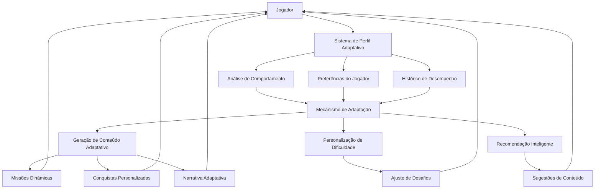

# Transformando o Sistema em um Verdadeiro RPG Adaptativo

## 1. Visão Geral

O Sistema Life já possui elementos fundamentais de um RPG gamificado com missões, habilidades, guildas e um sistema de progressão baseado em níveis. Para transformá-lo em um verdadeiro RPG adaptativo, precisamos aprimorar os mecanismos de personalização, introduzir sistemas de narrativa dinâmica e criar uma experiência verdadeiramente adaptativa que responda ao comportamento, preferências e desempenho do jogador.

## 2. Arquitetura do Sistema Adaptativo

### 2.1 Componentes Principais

## 3. Mecanismos de Adaptação

### 3.1 Sistema de Perfil Adaptativo
- **Coleta de Dados**: Monitorar comportamentos, preferências e desempenho do jogador
- **Análise de Padrões**: Identificar padrões de engajamento, horários de pico e tipos de conteúdo preferidos
- **Modelagem de Preferências**: Criar um perfil dinâmico que evolui com o tempo

### 3.2 Mecanismo de Adaptação
- **Adaptação de Conteúdo**: Modificar o tipo e estilo de missões com base no perfil
- **Adaptação de Dificuldade**: Ajustar automaticamente a complexidade das tarefas
- **Adaptação Temporal**: Sugerir atividades nos horários ideais para o jogador

### 3.4 Sistema de Balanceamento de Dificuldade Adaptativa
- **Ajuste Dinâmico de XP**: Modificar a quantidade de XP com base no desempenho do jogador
- **Modificadores de Dificuldade**: Aplicar bônus ou penalidades com base no histórico de sucesso
- **Curva de Aprendizado Personalizada**: Adaptar a progressão com base na taxa de aprendizado do jogador

### 3.3 Integração com os Flows de IA Existentes
- **Aproveitamento de generate-next-daily-mission**: Utilizar o histórico de missões e feedback do usuário para criar adaptações mais inteligentes
- **Personalização via generate-user-achievements**: Criar conquistas verdadeiramente personalizadas com base no comportamento do jogador
- **Avatar adaptativo**: Evoluir o avatar com base nas conquistas e especializações do jogador

## 4. Elementos de Narrativa Adaptativa

### 4.1 Sistema de História Dinâmica
- **Narrativa Ramificada**: Criar histórias que se ramificam com base nas escolhas do jogador
- **Personagens Adaptativos**: Desenvolver personagens que respondem às ações do jogador
- **Eventos Contextuais**: Gerar eventos especiais com base no progresso e conquistas

### 4.3 Integração com o Sistema de Guildas
- **Narrativas de Guilda Adaptativas**: Criar histórias específicas para cada guilda com base em seus objetivos
- **Missões de Guilda Dinâmicas**: Gerar missões cooperativas com base nas habilidades dos membros
- **Evolução da Guilda**: Permitir que as guildas evoluam com base na atividade e conquistas dos membros

### 4.4 Sistema Social Adaptativo
- **Compatibilidade de Jogadores**: Sugerir conexões com outros jogadores com base em interesses e metas similares
- **Guildas Inteligentes**: Recomendar guildas com base no perfil e histórico do jogador
- **Interações Personalizadas**: Adaptar o tipo de interações sociais com base nas preferências do jogador

### 4.2 Mundo em Evolução
- **Ambientes Dinâmicos**: Alterar a aparência do mundo com base no progresso do jogador
- **Economia Adaptativa**: Ajustar preços e disponibilidade de itens com base na atividade do jogador
- **Ecossistema Vivo**: Criar uma sensação de mundo vivo com eventos aleatórios e notícias

## 5. Sistemas de Progressão Avançados

### 5.1 Árvores de Habilidades Complexas
- **Especializações**: Permitir que os jogadores se especializem em caminhos específicos
- **Habilidades Passivas**: Introduzir bônus passivos que afetam o desempenho geral
- **Sistemas de Talentos**: Criar árvores de talentos que oferecem escolhas significativas

### 5.2 Sistema de Classe Dinâmica Baseado em Metas
- **Classes Derivadas de Metas**: Criar classes automaticamente com base nas metas definidas pelo jogador
- **Evolução de Classe**: Permitir que as classes evoluam com base no progresso nas metas
- **Habilidades Contextuais**: Desenvolver habilidades específicas para cada tipo de meta (saúde, carreira, aprendizado)

### 5.3 Sistema de Progressão Adaptativa
- **Níveis Dinâmicos**: Ajustar a curva de experiência com base no desempenho do jogador
- **Recompensas Escalonadas**: Oferecer recompensas proporcionais ao esforço e dificuldade
- **Marços Personalizados**: Criar objetivos específicos com base no histórico do jogador
- **Classes Adaptativas**: Classes que evoluem com base nas ações do jogador
- **Multiclasse Dinâmica**: Permitir combinações de classes com base em desempenho
- **Subclasses Temáticas**: Criar subclasses com base em interesses e metas específicas

## 6. Mecânicas de Engajamento Adaptativo

### 6.1 Sistema de Recompensas Inteligente
- **Recompensas Personalizadas**: Oferecer recompensas com base nas preferências do jogador
- **Economia de Recompensas**: Criar um sistema de moedas e recursos com valor percebido
- **Recompensas Surpresa**: Implementar recompensas inesperadas para manter o interesse

### 6.4 Sistema de Loja Adaptativa
- **Itens Personalizados**: Oferecer itens com base nas metas e interesses do jogador
- **Preços Dinâmicos**: Ajustar preços com base na atividade e progresso do jogador
- **Itens Exclusivos**: Criar itens únicos com base nas conquistas do jogador

### 6.2 Desafios Dinâmicos
- **Desafios Temporais**: Criar eventos limitados com recompensas exclusivas
- **Desafios Competitivos**: Introduzir competições com outros jogadores
- **Desafios Cooperativos**: Desenvolver missões que requerem cooperação entre jogadores

### 6.3 Sistema de Missões Adaptativas Baseado no Código Existente
- **Aprimoramento do generate-next-daily-mission**: Utilizar feedback mais detalhado para criar missões progressivamente mais adequadas
- **Sequenciamento Inteligente de Missões**: Criar cadeias de missões que se adaptam ao desempenho do jogador
- **Missões Personalizadas por Categoria**: Gerar missões específicas com base nas categorias de metas do jogador

## 7. Interface e Experiência do Usuário Adaptativa

### 7.1 Interface Personalizável
- **Temas Dinâmicos**: Alterar temas com base no progresso e conquistas
- **Layout Adaptativo**: Ajustar layouts com base nos padrões de uso
- **Acessibilidade Inteligente**: Adaptar a interface para diferentes necessidades

### 7.2 Feedback Adaptativo
- **Sistema de Notificações Inteligente**: Enviar notificações no momento ideal
- **Feedback Contextual**: Fornecer feedback relevante com base na atividade atual
- **Celebração de Conquistas**: Criar momentos especiais para marcos importantes

### 7.3 Dashboard Adaptativo Baseado no Componente Existente
- **Visualização de Dados Personalizada**: Mostrar estatísticas mais relevantes com base no comportamento do jogador
- **Widgets Dinâmicos**: Alterar os widgets exibidos com base nas necessidades atuais
- **Recomendações em Tempo Real**: Apresentar sugestões contextuais no dashboard

## 8. Integração com IA para Adaptação

### 8.1 Análise Preditiva
- **Previsão de Desengajamento**: Identificar sinais de desinteresse antes que ocorram
- **Sugestões Proativas**: Oferecer conteúdo antes que o jogador o procure
- **Ajuste Preventivo**: Adaptar a experiência antes que problemas surjam

### 8.2 Geração de Conteúdo Dinâmico
- **Narrativa Gerada por IA**: Criar histórias e diálogos personalizados
- **Missões Únicas**: Gerar missões específicas para cada jogador
- **Personagens Dinâmicos**: Desenvolver personagens que evoluem com o jogador

### 8.3 Aprimoramento dos Flows de IA Existentes
- **generate-next-daily-mission adaptativo**: Incorporar análise de padrões de desempenho para sugerir missões mais adequadas
- **generate-user-achievements preditivo**: Criar conquistas que incentivem o jogador a continuar engajado
- **generate-hunter-avatar evolutivo**: Desenvolver avatares que reflitam a jornada e especializações do jogador

### 8.4 Sistema de IA Adaptativa para Interações
- **Personalidade da IA Ajustável**: Adaptar o tom e estilo da IA com base nas preferências do jogador
- **Assistente Contextual**: Criar um assistente que fornece ajuda específica com base na atividade atual
- **Feedback da IA**: Desenvolver feedback personalizado com base no desempenho e histórico do jogador

## 9. Métricas de Sucesso Adaptativo

### 9.1 Indicadores de Engajamento
- **Tempo de Sessão**: Monitorar a duração das sessões de uso
- **Frequência de Uso**: Analisar padrões de uso diário/semanal
- **Taxa de Retenção**: Medir o retorno dos jogadores após períodos de inatividade

### 9.2 Indicadores de Satisfação
- **Feedback Qualitativo**: Coletar avaliações e comentários dos jogadores
- **Taxa de Conclusão**: Medir a porcentagem de missões concluídas
- **Engajamento Social**: Analisar a participação em guildas e interações sociais